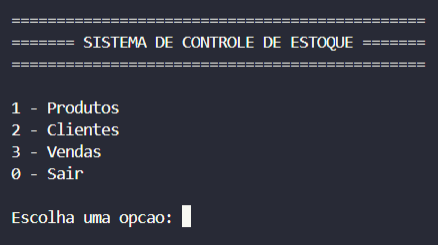
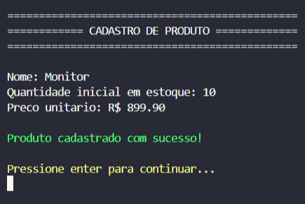
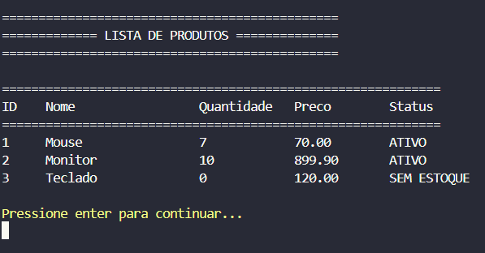
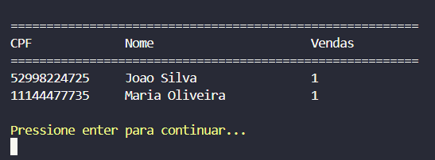
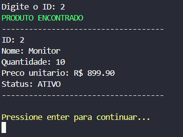
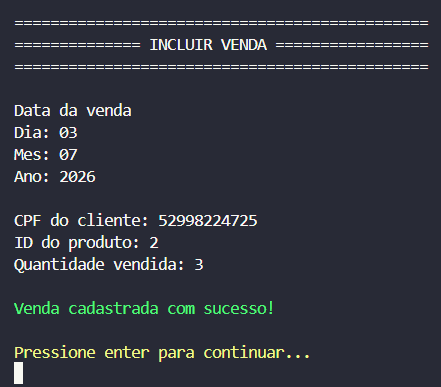

# 📦 Sistema de Controle de Estoque

Sistema de controle de estoque desenvolvido em **linguagem C** para a disciplina de Programação.

O projeto simula um sistema de gerenciamento de estoque por meio de um menu interativo no terminal, permitindo o controle de produtos, clientes e vendas.

---

## 👨‍💻 Desenvolvedores

| Nome | GitHub |
|------|--------|
| Pedro Aragoni | @pedroaragoni-dev |
| Ryan Lucca | @ryanluccadev |

---

## 🚀 Funcionalidades

### 📦 Produtos

- Cadastro de produtos
- Exclusão lógica de produtos
- Listagem de produtos
- Busca por ID
- Busca por parte do nome
- Atualização de estoque
- Cálculo do valor total do estoque
- Relatório de estoque baixo
- Validação de nome duplicado
- Validação de preço e quantidade

### 👤 Clientes

- Cadastro de clientes
- Listagem de clientes
- Validação oficial de CPF
- Verificação de CPF duplicado
- Controle da quantidade de vendas realizadas

### 🛒 Vendas

- Cadastro de vendas
- Listagem de vendas
- Associação entre cliente e produto
- Atualização automática do estoque
- Atualização do total de vendas do cliente
- Validação de estoque disponível

---

## 📁 Estrutura do Projeto

```text
Projeto-Controle-de-Estoque/
│
├── imagens/
│   ├── menu.png
│   ├── cadastro-produto.png
│   ├── lista-produtos.png
│   ├── lista-clientes.png
│   ├── busca-produto.png
│   └── cadastro-venda.png
│
├── output/
│
├── main.c
├── produtos.c
├── clientes.c
├── vendas.c
└── README.md
```

---

## 🛠️ Tecnologias Utilizadas

- Linguagem C
- Visual Studio Code
- Git
- GitHub

---

## 📚 Conceitos Aplicados

Durante o desenvolvimento do projeto foram utilizados diversos conceitos fundamentais da linguagem C, entre eles:

- Structs
- Vetores
- Funções
- Modularização
- Validação de dados
- Manipulação de strings
- Busca linear
- Exclusão lógica
- Controle de estoque
- Menus interativos

---

# 📷 Demonstração

## 🏠 Menu Principal



---

## 📦 Cadastro de Produto



---

## 📋 Listagem de Produtos



---

## 👤 Listagem de Clientes



---

## 🔎 Busca de Produto



---

## 🛒 Cadastro de Venda



---

## 🎯 Objetivo

Desenvolver um sistema de controle de estoque utilizando programação estruturada em C, aplicando conceitos de modularização, validação de dados e manipulação de estruturas, simulando operações reais de gerenciamento de produtos, clientes e vendas.

---

## 📄 Licença

Projeto desenvolvido exclusivamente para fins acadêmicos para a disciplina de Programação.
